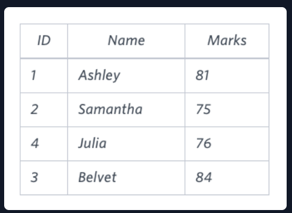

# Higher Than 75 Marks

## Problem Statement:
Query the Name of any student in STUDENTS who scored higher than  Marks. Order your output by the last three characters of each name. If two or more students both have names ending in the same last three characters (i.e.: Bobby, Robby, etc.), secondary sort them by ascending ID.

Input Format

The STUDENTS table is described as follows:
<br>

The Name column only contains uppercase (A-Z) and lowercase (a-z) letters.

Sample Input
<br>

Sample Output
```
Ashley
Julia
Belvet
```
## Solution:

``` SQL
SELECT Name
FROM STUDENTS
WHERE Marks>75
ORDER BY RIGHT(Name,3) ASC,ID ASC


