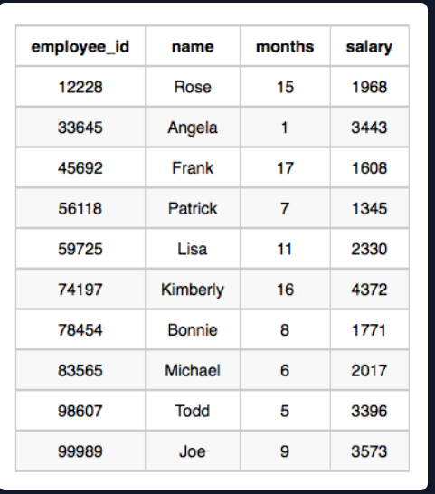

# Employee Names

## Problem Statement:
Write a query that prints a list of employee names (i.e.: the name attribute) from the Employee table in alphabetical order.

Input Format

The Employee table containing employee data for a company is described as follows:
<br>

where employee_id is an employee's ID number, name is their name, months is the total number of months they've been working for the company, and salary is their monthly salary.

Sample Input
<br>

Sample Output
```
Angela
Bonnie
Frank
Joe
Kimberly
Lisa
Michael
Patrick
Rose
Todd
```
## Solution:
```SQL
Select Name
From Employee
Order by name