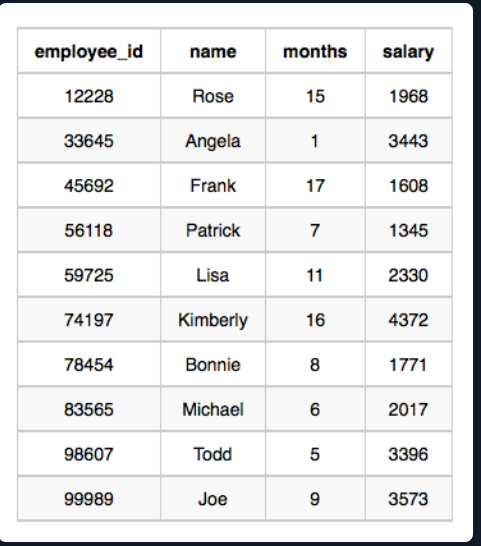

# Employee Salaries

## Problem Statement:
Write a query that prints a list of employee names (i.e.: the name attribute) for employees in Employee having a salary greater than $2000  per month who have been employees for less than 10 months. Sort your result by ascending employee_id.

Input Format

The Employee table containing employee data for a company is described as follows:
<br><br>
where employee_id is an employee's ID number, name is their name, months is the total number of months they've been working for the company, and salary is the their monthly salary.

Sample Input
<br> <br>
Sample Output
```
Angela
Michael
Todd
Joe
```
## Explanation:
Angela has been an employee for  month and earns  per month.
Michael has been an employee for  months and earns  per month.
Todd has been an employee for  months and earns  per month.
Joe has been an employee for  months and earns  per month.
We order our output by ascending employee_id.

## Solution:
```SQL
SELECT name
FROM Employee
WHERE salary >2000
AND months<10
ORDER BY employee_id ASC
