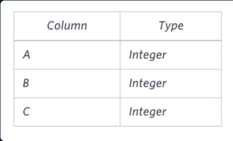
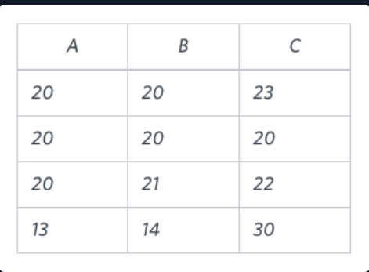

# Type Of Triangle

## Problem Statement:
Write a query identifying the type of each record in the **TRIANGLES** table using its three side lengths. Output one of the following statements for each record in the table:

**Equilateral:** It's a triangle with 3 sides of equal length.<br>
**Isosceles:** It's a triangle with 2 sides of equal length.<br>
**Scalene:** It's a triangle with 3 sides of differing lengths.<br>
**Not A Triangle:** The given values of A, B, and C don't form a triangle.<br>
Input Format
The TRIANGLES table is described as follows:
<br><br>

Each row in the table denotes the lengths of each of a triangle's three sides.
Sample Input
<br><br>
Sample Output
```
Isosceles
Equilateral
Scalene
Not A Triangle
```

## Explanation:
Values in the tuple(20,20,30)  form an Isosceles triangle, because A=B.
Values in the tuple(20,20,20)  form an Equilateral triangle, because A=B=C. Values in the tuple (20,21,22) form a Scalene triangle, because A<>B<>C.
Values in the tuple (13,14,30) cannot form a triangle because the combined value of sides A and B is not larger than that of side C.

## Solution:
``` SQL
SELECT
CASE WHEN A+B <=C OR A+C<=B OR B+C<=A THEN 'Not A Triangle' 
         WHEN (A=B  AND B=C)OR (B=C AND C=A)  THEN 'Equilateral' 
         WHEN A=B OR B=C OR C=A THEN 'Isosceles' 
         ELSE 'Scalene' END
FROM TRIANGLES
