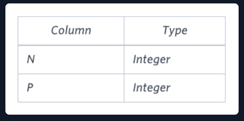
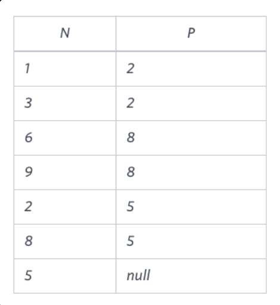

# Binary Tree

## Problem Statement:
You are given a table, BST, containing two columns: N and P, where N represents the value of a node in Binary Tree, and P is the parent of N.<br>
<br>
Write a query to find the node type of Binary Tree ordered by the value of the node. Output one of the following for each node:<br>

**-Root:** If node is root node.<br>
**-Leaf:** If node is leaf node.<br>
**-Inner:** If node is neither root nor leaf node.<br>
Sample Input <br>
<br>
Sample Output<br>
```
1 Leaf
2 Inner
3 Leaf
5 Root
6 Leaf
8 Inner
9 Leaf
```
**Explanation**<br>
The Binary Tree below illustrates the sample:
<br>

## SOlution:
``` SQL
SELECT CASE WHEN P IS NULL THEN CAST(N AS VARCHAR(3)) +' Root'
              WHEN N IN (SELECT P FROM BST) AND P IS NOT NULL THEN  CAST(N AS VARCHAR(3))+' Inner' 
              ELSE  CAST(N AS VARCHAR(3))+' Leaf'
              END
FROM BST
ORDER BY N