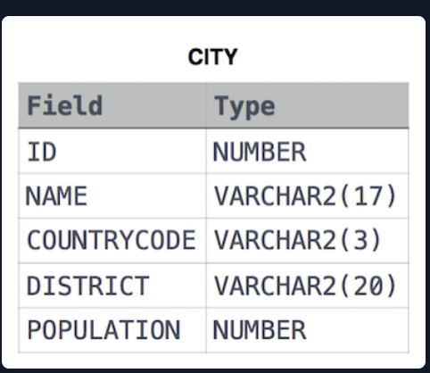

#  Revising Aggregations-Average

## Problem Statement:
Query the average population of all cities in CITY where District is California.<br>
Input Format<br>
The CITY table is described as follows:<br>
<br>

## Solution:
``` SQL
SELECT AVG(POPULATION)
FROM CITY
WHERE DISTRICT='California'