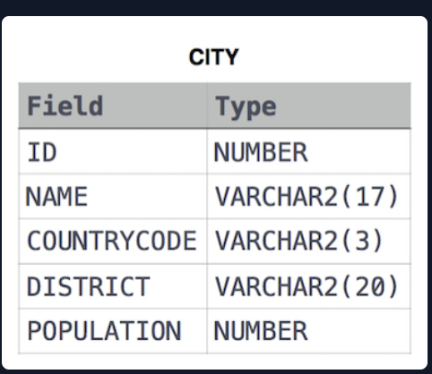

# Japan Population

## Problem Statement:
Query the sum of the populations for all Japanese cities in CITY. The COUNTRYCODE for Japan is JPN.

Input Format

The CITY table is described as follows:
<br><br>

## Solution:
```SQL
SELECT SUM(POPULATION)
FROM CITY
WHERE COUNTRYCODE='JPN'
