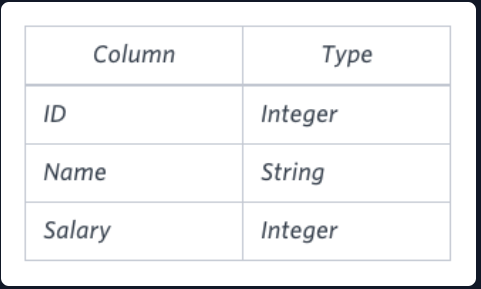

# The Blunder
## Problem Statement:
Samantha was tasked with calculating the average monthly salaries for all employees in the EMPLOYEES table, but did not realize her keyboard's  key was broken until after completing the calculation. She wants your help finding the difference between her miscalculation (using salaries with any zeros removed), and the actual average salary.

Write a query calculating the amount of error (i.e.:  average monthly salaries), and round it up to the next integer.

Input Format

The EMPLOYEES table is described as follows:<br>

<br><br>

Note: Salary is per month.

Constraints

1000<salary<10^5

Sample Input<br>
The EMPLOYEES table is described as follows:<br>
<br><br>
Sample Output<br>
```2061```

Explanation

The table below shows the salaries without zeros as they were entered by Samantha:
<br><br>

Samantha computes an average salary of 98.00 . The actual average salary is 2159.00.

The resulting error between the two calculations is <br>
2159.00-98.00=2061.00. Since it is equal to the integer 2061, it does not get rounded up.<br>


## Solution:
```SQL
SELECT CEILING(AVG(CAST(Salary AS DECIMAL(9,2))) - AVG(CAST(REPLACE(Salary,0,'') AS DECIMAL(9,2))))
FROM EMPLOYEES

