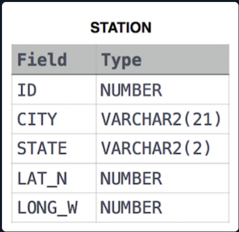

# Weather Observation Station 17
## Problem Statement :
Query the Western Longitude (LONG_W)where the smallest Northern Latitude (LAT_N) in STATION is greater than 38.7780. Round your answer to 4 decimal places.<br>
Input Format<br>

The STATION table is described as follows:<br><br>
<br><br>
where LAT_N is the northern latitude and LONG_W is the western longitude.<br>

# Solution :
```SQL
SELECT CAST(LONG_W AS DECIMAL(10,4))
FROM STATION
WHERE  LAT_N=(SELECT MIN(LAT_N)
                             FROM STATION
                             WHERE LAT_N>38.7780
                             )
