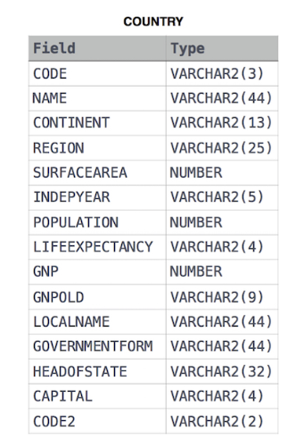

# Population Census
## Problem Statement:
Given the CITY and COUNTRY tables, query the sum of the populations of all cities where the CONTINENT is 'Asia'.<br>

Note: CITY.CountryCode and COUNTRY.Code are matching key columns.<br>

Input Format<br>

The CITY and COUNTRY tables are described as follows:<br>

<br><br>
<br><br>

## Solution:
```SQL
SELECT SUM(A.POPULATION)
FROM CITY A
JOIN COUNTRY B
ON A.COUNTRYCODE=B.CODE
AND B.CONTINENT='Asia'
