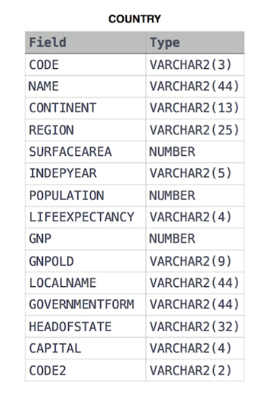

# Average Population Of Each Continent
## Problem Statement:
Given the CITY and COUNTRY tables, query the names of all the continents (COUNTRY.Continent) and their respective average city populations (CITY.Population) rounded down to the nearest integer.<br>

Note: CITY.CountryCode and COUNTRY.Code are matching key columns.<br>

Input Format<br>

The CITY and COUNTRY tables are described as follows:<br>

<br><br>
<br>

## Solution:
```SQL
SELECT CONTINENT,FLOOR(AVG(A.POPULATION))
FROM CITY A
JOIN COUNTRY B
ON A.COUNTRYCODE=B.CODE
GROUP BY (B.CONTINENT)